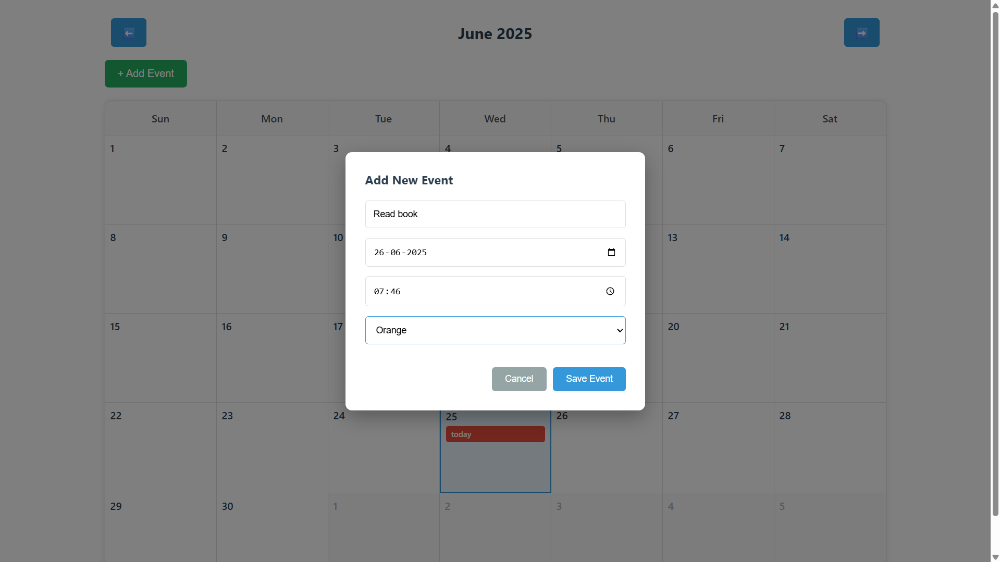
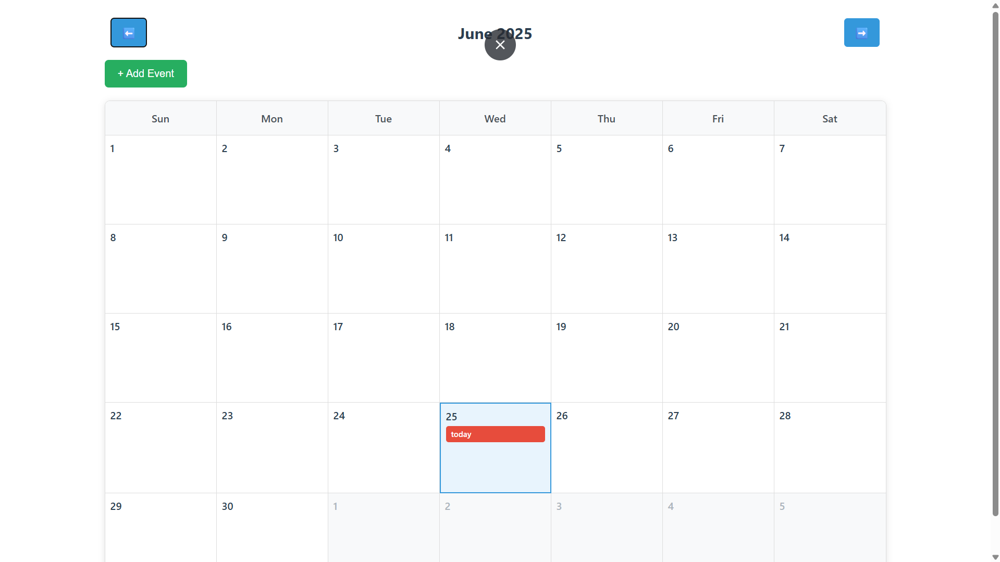

****Calendar Event Manager****

A simple yet powerful calendar application built with React for managing events and appointments. Perfect for keeping track of your schedule with an intuitive interface.
Features

📅 Monthly Calendar View - Navigate through months with easy arrow controls
➕ Add Events - Create new events with title, date, time, and color coding
🎨 Color Coding - Organize events with different colors (Blue, Red, Green, Orange, Purple)
📱 Responsive Design - Works seamlessly on desktop and mobile devices
⚡ Real-time Updates - Events appear instantly after creation
🔍 Today Highlight - Current date is clearly marked

Screenshots
Show Image
Main calendar interface with events
Getting Started
Prerequisites

Node.js (v14 or higher)
npm or yarn
